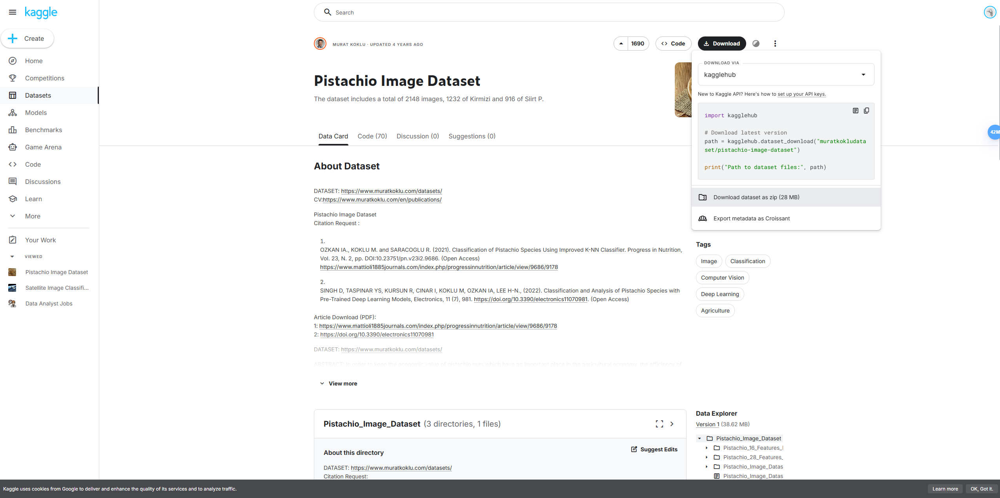
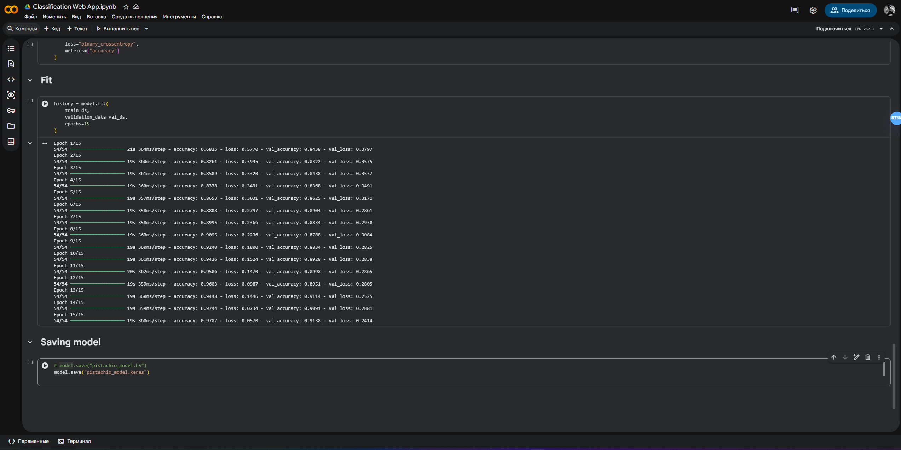
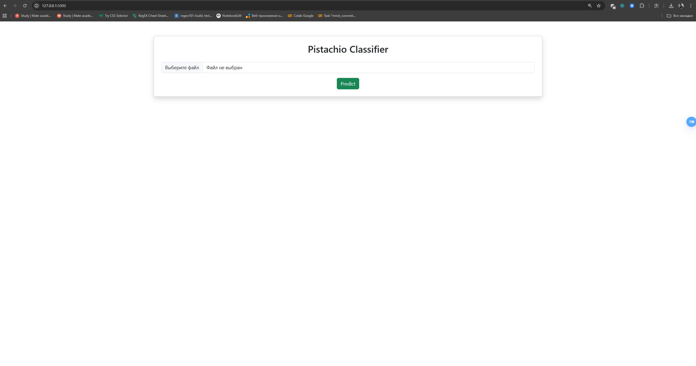

# Pistachio Image Classification

# Check it out: https://pistachio-classifier.onrender.com/


This project is a **Deep Learning image classifier** built with **TensorFlow** and a user-friendly **Flask web interface**. The model classifies pistachio images into two categories:

- **Kirmizi Pistachio**  
- **Siirt Pistachio**

The model was trained on a custom dataset and reaches a **validation accuracy of ~91.38%** — enough for a real-world demonstration project.

---

## Dataset

This dataset was used for training and evaluation:

 **Pistachio Image Dataset (Kaggle)**  
https://www.kaggle.com/datasets/muratkokludataset/pistachio-image-dataset


> The dataset is *not included* in this repository due to size limits — only the trained model is included.

---

##  Model Training

The training and evaluation were performed in Google Colab using TensorFlow.

 **Colab Notebook Link:**  
https://colab.research.google.com/drive/175HOKImht4Vve-qJKsWr7R7Abfeq8bo0?usp=sharing


You can open this notebook to:
- Download and preprocess the dataset
- Train the CNN model
- Visualize training performance (accuracy/loss curves)
- Save the final model

---

##  How to Run the Web App

This project uses **Flask** to serve a simple interface where users can upload a pistachio image for classification.

###  1. Clone the repo

```bash
git clone https://github.com/UrbanAstronaut88/pistachio-classifier.git
cd pistachio-classifier
```

### 2. Install dependencies
```pip install -r requirements.txt```

### 3. Run the Flask server
```python app.py```

### 4. Open in Browser
```http://127.0.0.1:5000```

Use the upload form to choose an image and get the prediction.

### Author:
* UrbanAstronaut88 / student of MateAcademy


